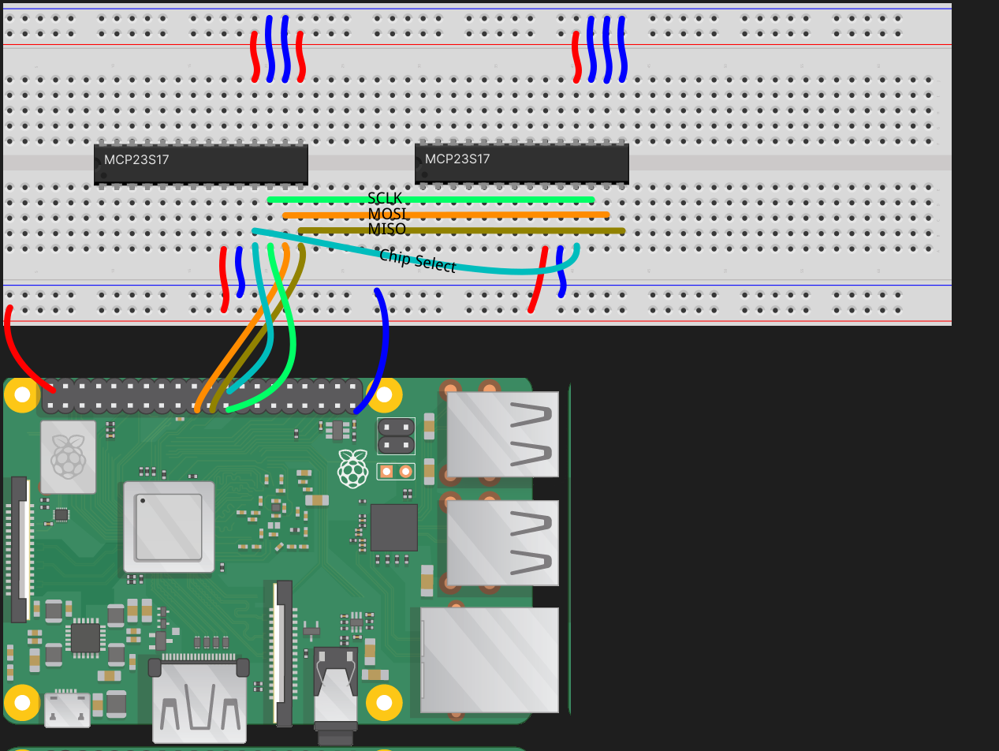

# MCP23S17
Java class for interfacing with the MCP23S17 IO expander with a Raspberry Pi.

## Examples
To run examples simply choose a class from `src/examples/java` and run it like so: 
`./gradlew runExample -Pexample=InputInterruptExample` 
or 
`./gradlew runExample -Pexample=ConsecutiveTurnOnExample`

*The ConsecutiveTurnOnExample class running on a RaspberryPi 3B*

### Wiring
For the ConsecutiveTurnOnExample, the following wiring was used:

*Simple wiring diagram for two chips on the same bus (made with [Figma](https://www.figma.com) and assets from [Fritzing parts](https://github.com/fritzing/fritzing-parts/tree/develop/svg/core/breadboard)).*
*To check RaspberryPi pin designations, use [pinout.xyz](https://pinout.xyz/) and the [MCP23S17 Datasheet](assets/datasheet-mcp23s17.pdf).*
 ***NOTE:** For the InputInterruptExample, one of the Interrupt ports of each chip has to be connected to BCM 22 (Chip 0) and BCM 23 (Chip 1). Not documented on the wiring diagram.*
## Building
Clone this repository and run

    ./gradlew jar
    
to build a JAR containing the MCP23S17 class only,

    ./gradlew shadowJar
    
to build a shadow JAR containing the MCP23S17 class *and* the
[pi4j](https://pi4j.com) dependency,

    ./gradlew sourcesJar
    
to build a sources JAR, and/or

    ./gradlew javadocJar
    
to build a javadoc JAR.
